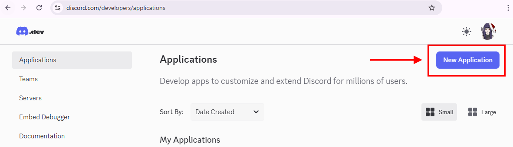
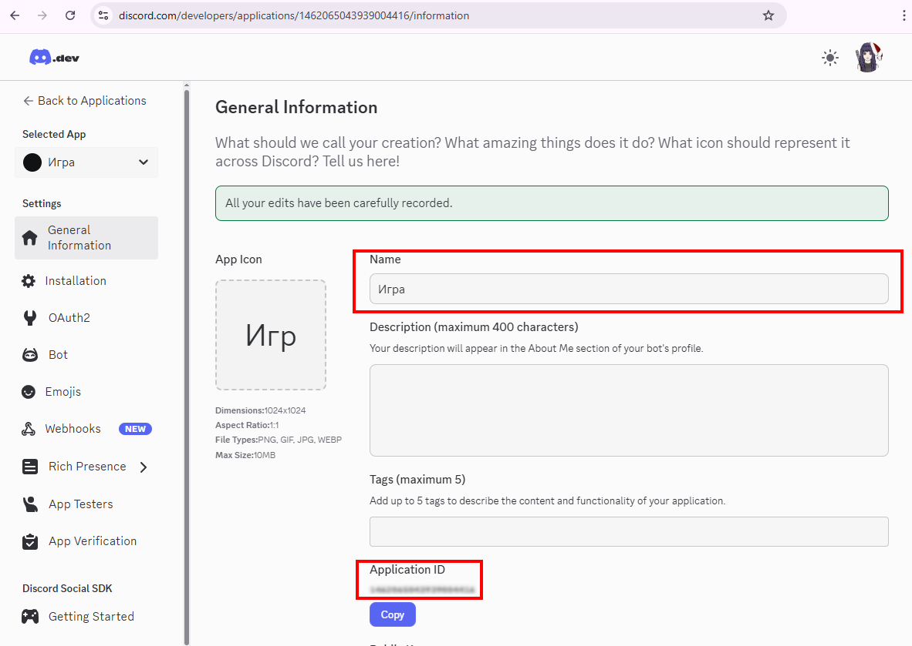
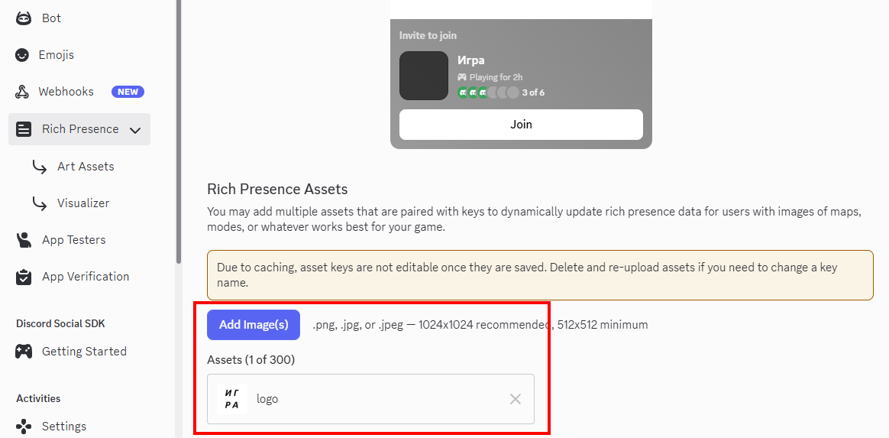
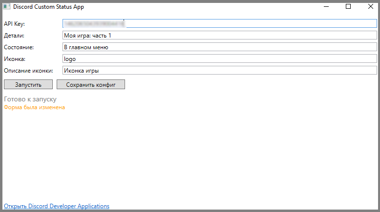
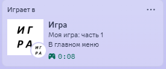

# DiscordCustomStatus

## Создание Discord App
### Шаг 1.
Перейти по ссылке на сайт https://discord.com/developers/applications

### Шаг 2.
Нажмите "New Application"

### Шаг 3.
На вкладке General Information:
* введите название игры,
* запомните Application ID.

### Шаг 4.
На вкладке Rich Presence:
* добавьте изображение и задайте его имя.

### Шаг 5.
Запустите DiscordCustomStatus.
* API Key - Application ID с шага 3.
* Детали - Детали об игре
* Состояние - в каком сотоянии сейчас игра
* Иконка - имя изображения с шага 4.
* Описание иконки - текст отображаемый при наведении на иконку.

Запустите игру.

### Результат

